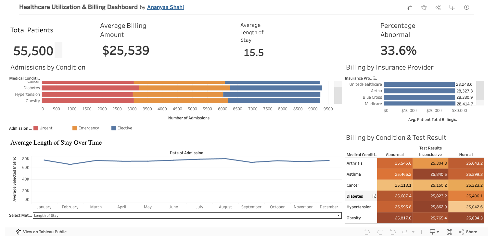

# Healthcare Utilization & Billing Dashboard

## Overview
An interactive Tableau dashboard analyzing patient admissions, 
billing patterns, and clinical outcomes across 55,500 patient 
records. Built to simulate the kind of claims analytics and 
utilization reporting used by healthcare technology companies.

## Business Problem
Healthcare organizations need to monitor:
- Which conditions are driving the highest admission volumes
- How billing costs vary across insurance providers
- Whether length of stay is trending up or down over time
- How test result outcomes correlate with billing costs

This dashboard answers all questions in a single 
interactive view.

## Live Dashboard
((https://public.tableau.com/app/profile/ananyaa.shahi/viz/HealthcareUtilizationBillingDashboard/HealthcareUtilizationBillingDashboard?publish=yes))

## Dashboard Preview

## Technical Highlights

**LOD Expression (Fixed)**
Used a FIXED level of detail expression to calculate 
accurate patient-level billing before averaging by 
insurance provider — preventing multi-record patients 
from skewing results:

**Dynamic Parameter Toggle**
Built a parameter-driven calculated field allowing users 
to switch between Average Length of Stay and Average 
Billing Amount on the trend chart without building 
separate views.

**Calculated Fields**
- Length of Stay: DATEDIFF between admission and 
  discharge dates
- % Abnormal Test Results: ratio of abnormal outcomes 
  to total records

**Interactivity**
- Filter actions across all sheets
- Date range filter affecting entire dashboard
- Parameter toggle for metric switching
- Custom tooltips on all charts

## Dashboard Components
| Sheet | Chart Type | Key Insight |
|-------|-----------|-------------|
| Admissions by Condition | Stacked bar | Volume and urgency by condition |
| Billing by Insurance Provider | Bar chart + LOD | Cost benchmarking by payer |
| Length of Stay Trend | Line chart + parameter | Operational trends over time |
| Billing by Condition & Test Result | Heatmap | Cost impact of clinical outcomes |

## Dataset
- **Source:** 
(https://www.kaggle.com/datasets/prasad22/healthcare-dataset)
- **Size:** 55,500 patient records
- **Fields:** 15 including condition, admission type, 
  billing amount, insurance provider, test results

## Tools
- Tableau Public
- Microsoft Excel (data preparation)

## Relevance
This project demonstrates skills directly applicable to 
roles at healthcare analytics companies including 
utilization management, claims processing analytics, 
and provider performance benchmarking.
